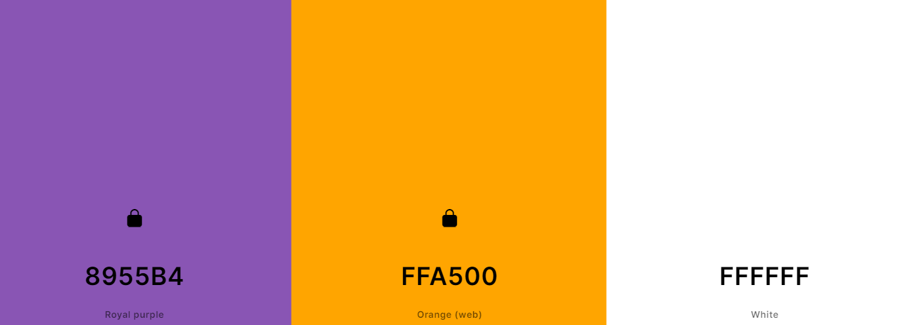
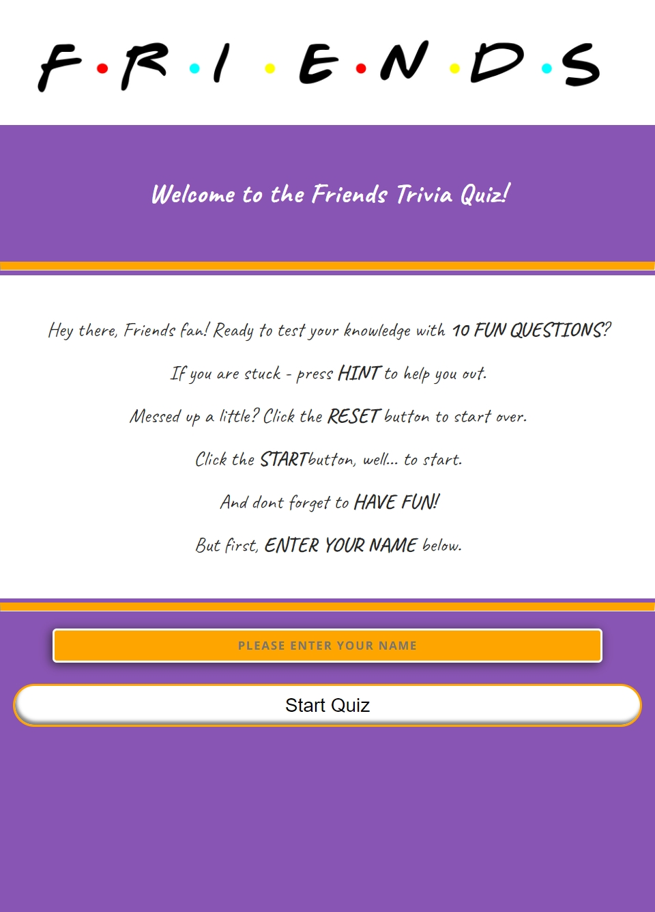
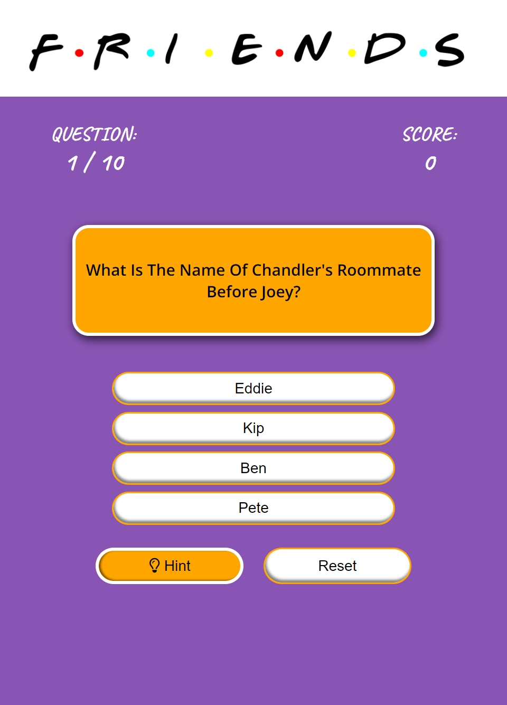
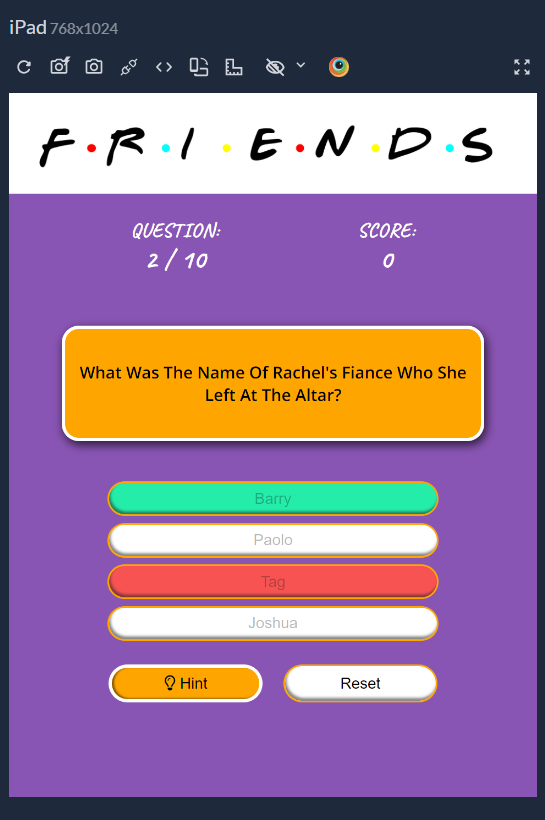
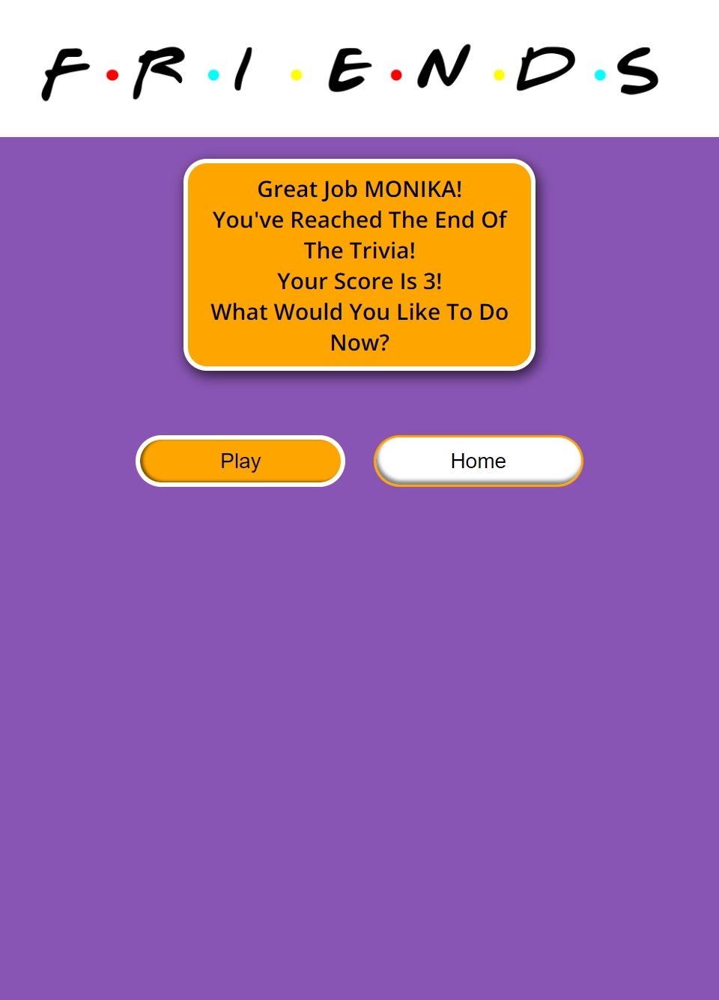
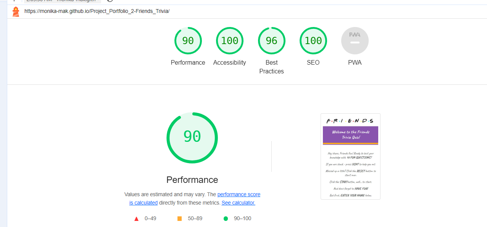
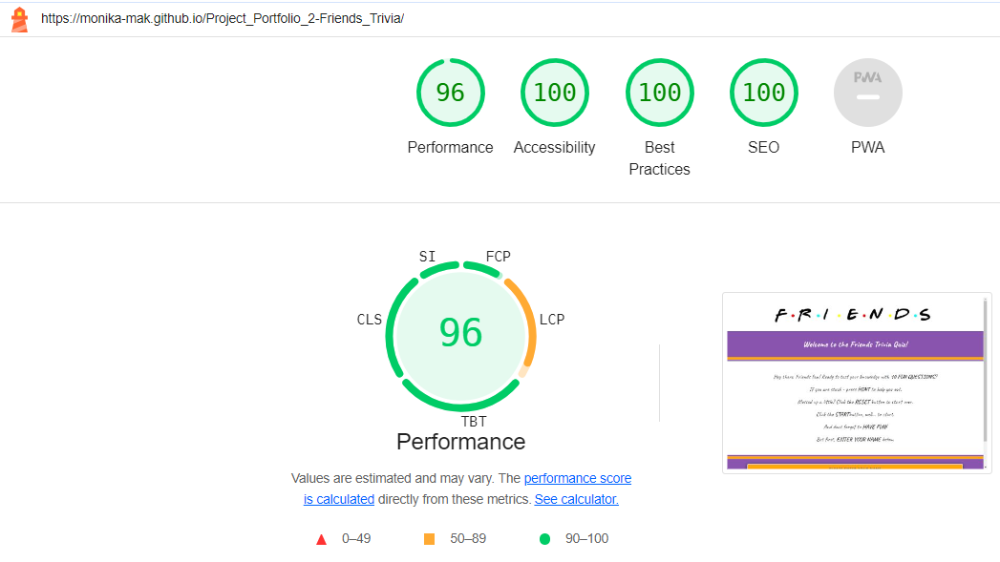

# Friends Trivia Quiz

Visit the deployed site here: [Friends Trivia Quiz](https://monika-mak.github.io/Project_Portfolio_2-Friends_Trivia/)

This website  is designed to bring fun and excitement. Created for the true fans of the TV show "Friends" who want to test their knowledge about the series. It aims to provide an engaging and fun way to revisit memorable moments and details from the show.

## UX

### User Stories

**As a user, I:**

- Want the quiz to be responsive to my devices.
- Want clear instructions on how to navigate through the quiz.
- Want to know how many questions there are.
- Want to know if I selected the correct answer.
- Want to get help if I am stuck on a question.
- Want to be able to reset the quiz if I made a mistake.
- Want to know what question number I am on during the quiz.
- Want to know my score during the quiz.
- Want to know what the correct answer is if I selected the wrong answer.
- Want to know my final score.

### First Time Visitor Goals

1. Understand the main purpose of the site and learn about the Friends trivia quiz.
2. Navigate the site easily to start the quiz or learn more about it.
3. Experience a flashback into the show's great moments.

### Returning Visitor Goals

1. Access new or updated quiz questions.
2. Switch off from everyday life and have fun.
3. Check for any new features or updates related to the quiz.

### Frequent User Goals

1. Stay updated with new trivia questions.
2. Regularly review and improve trivia knowledge.

## Design

### Colour Scheme

The website uses a palette of purple, orange, and white. These colors were carefully selected to evoke the famous apartment with the iconic purple door with a golden frame.

### Typography

I chose the Google font Caveat to mimic the famous Friends font (Gabriel Weiss), balanced with classy Open Sans for good readability.

### Logo

The main concept of creating the logo was to bring the user back in time to their favorite TV show. The logo is made of letters F-R-I-E-N-D-S with multicolor dots in between each letter. Created by myself using the Gabriel Weiss font that was originally used for the show's logo and then converted into a picture for ease of use and consistency.

### Wireframes

- Welcome Page - [View](readme_documents/wire_frames/wire_frame_1.jpg)
- Quiz Game - [View](readme_documents/wire_frames/wire_frame_2.jpg)
- Results Page - [View](readme_documents/wire_frames/wire_frame_3.jpg)

 

# Friends Trivia Quiz Feature Overview

## Website Structure and Navigation
- **Logo and Branding:** The Friends Trivia Quiz logo is prominently displayed at the top of the page, reinforcing the theme on every page.

### Welcome Page

- **Welcome Message:** On arrival, the user is welcomed in a very friendly manner with a message. The text highlights the number of questions, describes the game, and gives helpful tips like the usage of hint and reset buttons. The user is directed to the bottom of the page to insert their name to start the game.Once the name is inserted, the user is advised to press the "start" button to begin.

    *Welcome Page Message*
    - 

 - **Name Validation:** In the event of no name inserted, the user is reminded to fill in the name by a drop-down message. 

    *Name Validation* 
    - [Name Validation](/readme_documents/name_validation.png)

### Quiz Section

- **Visual Appeal:** The quiz logo appears at the top of the page. On the left under the logo, a counter displays the current question number out of 10. On the right, a score counter shows the number of correct answers. Below the scores, a random question is displayed with four possible answers. Underneath the answers, there are hint and reset buttons.
  - 
- **Feedback:** When an incorrect answer is selected, the option button turns red, and the correct answer turns green. Once an answer is selected, the options are disabled to ensure the correct score is recorded.
  - 

### End Game Page and Results

- **Message:** The user is congratulated with a personalized message and their score, informed that they have reached the end of the game, and given options to play again or go back to the home page.
  - 

#### Error Page

- **Error Message:** This page was designed for learning purposes; no try and catch error needed as there are no external applications used for the purpose of this quiz.
  - *Error Page* - [View](readme_documents/error-page-screenshot.png)

### Functional Highlights

- **User Input:** If no name is entered, a pop-up message appears.
- **Start Button:** Initiates the quiz.
- **Multiple Choice Section:** Users select one of four answers, with color-coded feedback.
- **Hint Button:** Provides a hint for the current question.
  - *Hint display* - [View](readme_documents/hint.png)

- **Reset:** Allows the user to start over, clearing the score and question counter.
- **Play Button:** Restarts the game.
- **Home Button:** Returns to the home page, ready for a new user to enter their name.

## Future Enhancements

- **Timer:** Adding a timer for increased difficulty.
- **Difficulty Levels:** Introducing questions with varying difficulty (easy, medium, hard).
- **Aesthetics:** A visually appealing pop-up message for name validation.
- **Community Features:** Options for users to save scores, share results on social platforms, and compete via a leaderboard.

### Resources and Tools Used

#### Fonts and Icons

- [Google Fonts](https://fonts.google.com/) - Provided fonts used throughout the website.
- [Font Awesome](https://fontawesome.com/) - Provided icons.
- [Dafont: Gabriel Weiss' Friends](https://www.dafont.com/gabriel-weiss-friends.font) - Used for creating the logo.

#### Development Tools

- [Google Dev Tools](https://developer.chrome.com/docs/devtools/) - Used for troubleshooting, testing, and solving issues related to responsiveness and styling.
- [GitHub](https://github.com/) - Used to save and store project files.

#### Image and Color Resources

- [Photopea](https://www.photopea.com/) - Used for logo creation.
- [Responsively](https://responsively.app/) - Used to capture website responsiveness.
- [Browserstack](https://www.browserstack.com/) - Used to test browser responsiveness.
- [Tiny PNG](https://tinypng.com/) - Compressed images to optimize website performance.
- [Favicon.io](https://favicon.io/) - Tool used to create the website's favicon.
- [Coolors](https://coolors.co/) - Assisted in creating a modern, matching color palette.
- [Canva](https://www.canva.com/) - Used for creating mockups and wireframes.

## Responsiveness

### Welcome Page
- Welcome page displayed on three different devices. 
    

Welcome Page Responsivenes

    *Welcome Page Mobile*

    

    *Welcome Page Tablet*

    
        
    *Welcome Page Desktop*

    

### Quiz Page
- Quiz page displayed on three different devices. 
    

Quiz Page Responsiveness

    *Quiz Page Mobile*

    

    *Quiz Page Tablet*

    
        
    *Quiz Page Desktop*

    

### End Page
- End page displayed on three different devices. 
    

End Page Responsiveness

    *End Page Mobile*

    

    *End Page Tablet*

    
        
    *End Page Desktop*

    

### Languages Used

- HTML
- CSS
- JavaScript

## Testing

### Code Validation

- The HTML validator returned no errors, [results](/readme_documents/W3C-JHint-validators/HTML_Validator.png "W3C HTML").
- The HTML Error page validator returned no errors,[results](/readme_documents/W3C-JHint-validators/HTML_Error_Page_Validator.png "W3C HTML Error Page").
- The CSS validator returned no errors, and one warning [results](/readme_documents/W3C-JHint-validators/CSS_DirectInput_Validator.png "W3C CSS").
- The CSS validator via URL returned no errors and no warnings [results](/readme_documents/W3C-JHint-validators/CSS_URL_Validation.png "W3C CSS URL").
- The JavaScript validator also returned no errors, [results](/readme_documents/W3C-JHint-validators/JS_Hint_Validator.png "JSHint").

### Lighthouse Testing

- The Lighthouse test for mobile passed 90% full rapport available here [rapport](readme_documents/lighthouse_testing/lighthouse_mobile_.rapport.html) 

- The Lighthouse test for desktop passed 96% - full rapport available here  [rapport](readme_documents/lighthouse_testing/lighthouse_desktop_rapport.html) .

### Browser Testing 

- The website has been tested on multiple browsers: Chrome, Firefox, Safari ,Edge and Opera with no errors or bugs. 

    

Browser Testing

    *Edge*

    

    *Firefox*

    

    *Safari*

    

    *Opera*

    

### Further Testing

Friends and family tested the site for usability issues and bugs with no errors unfixed.

### Known Bugs / fixed bugs 
- #### No known bugs recorded at the end of the project.
  Many of the issues I had found were simple semicolons or naming mistakes and some were as complicated as function being connected incorreclty. Once one bug was fixed another appeared which made the learning really deep.
  Many bugs during the process of making it abd to list them all would be a challenge. The main issue I had was with answerr button colors and hint and had used tutor support on this ocassions. 
  The score wont load properly - function issue, naming was incorrect.
  Colors on the correct / incorrect buttons wont apply properly - I was targeting answer buttons not buttons individually.
  Buttons wont apply correct colors - Changed accepthing answers tio true, used const not let  
  Colors apply but on background not buttons - solved with tutor help, parent element was the issue, 
  Color worked but not always - it was spotted by tutor , mouse was still hovering over it - disabled mouse afetr the answer was made. 
  Hint messsage was not clearing - hint name was chaged to a fixed name , but after the call with mentor I got a great advice to change the whole naming and and separate icon with a span. 

## Deployment

### GitHub Pages

The project was deployed to GitHub Pages using the following steps:

1. Log in to GitHub and locate the [Friends_Trivia Repository](https://github.com/monika-mak/Project_Portfolio_2-Friends_Trivia).
2. At the top of the Repository (not top of page), locate the "Settings" button on the menu.
3. Scroll down the Settings page until you locate the "GitHub Pages" section.
4. Under "Source," click the dropdown called Source is set to 'Deploy from Branch' and select "main."
5. Make sure the folder is set to / (root).
6. Under Branch, click Save. The page will automatically refresh.
7. Scroll back down through the page to locate the now published site [Friends Trivia Quiz](https://monika-mak.github.io/Project_Portfolio_2-Friends_Trivia/) in the "GitHub Pages" section.

### Forking the GitHub Repository

By forking the GitHub Repository, we make a copy of the original repository on our GitHub account to view and/or make changes without affecting the original repository by using the following steps:

1. Log in to GitHub and locate the [Friends_Trivia Repository](https://github.com/monika-mak/Project_Portfolio_2-Friends_Trivia)
2. At the top of the Repository (not top of page) just above the "Settings" button on the menu, locate the "Fork" button.
3. You should now have a copy of the original repository in your GitHub account.

## Credits

### Idea

The game was inspired by my son who loves "Friends" and my own personal love for that show which made me laugh for so many years.

### Content

Content was inspired mainly by the tutorials below:
- Code Institute : Love Maths Project Walkthrough
- [How To Make Quiz App Using JavaScript](https://www.youtube.com/watch?v=PBcqGxrr9g8&t=1741s)
- [Build a Quiz App](https://www.youtube.com/watch?v=rFWbAj40JrQ&list=PLB6wlEeCDJ5Yyh6P2N6Q_9JijB6v4UejF)
- README- some inspiration taken from [KevinFlanagan7Masters README](https://github.com/KevinFlanagan7/Masters-quiz/blob/main/README.md) Thank you Kevin. 

### Learning and Support Resources

- [W3Schools](https://www.w3schools.com/) - For learning and practice.
- [YouTube](https://www.youtube.com/) - To source a deeper understanding of concepts.
- [Code Institute](https://codeinstitute.net/) - To structure and support learnings.
- [ChatGPT](https://openai.com/chatgpt) - generating questions, quick information support when needed.
- [Perplexity AI](https://www.perplexity.ai/) - For a focused source of information in one place.
- [SoloLrarn](https://www.sololearn.com/en/) - Java Script constant practise.
- [Study Music, Concentration, Focus](https://www.youtube.com/results?search_query=study+music+concentration+focus) - To keep me calm during work.

### Acknowledgements

A massive shout-out to:

- Amy Richardson again, thank you for your constant support as well as great advices and tips given throughout the process.
- Femi - my mentor who utilized our meetings very well, giving constructive feedback and excellent practice, your feedback is always very powerful and to the point.
- Huge thanks to the tutor support and community. It was a great help to feel like I am not here alone.
