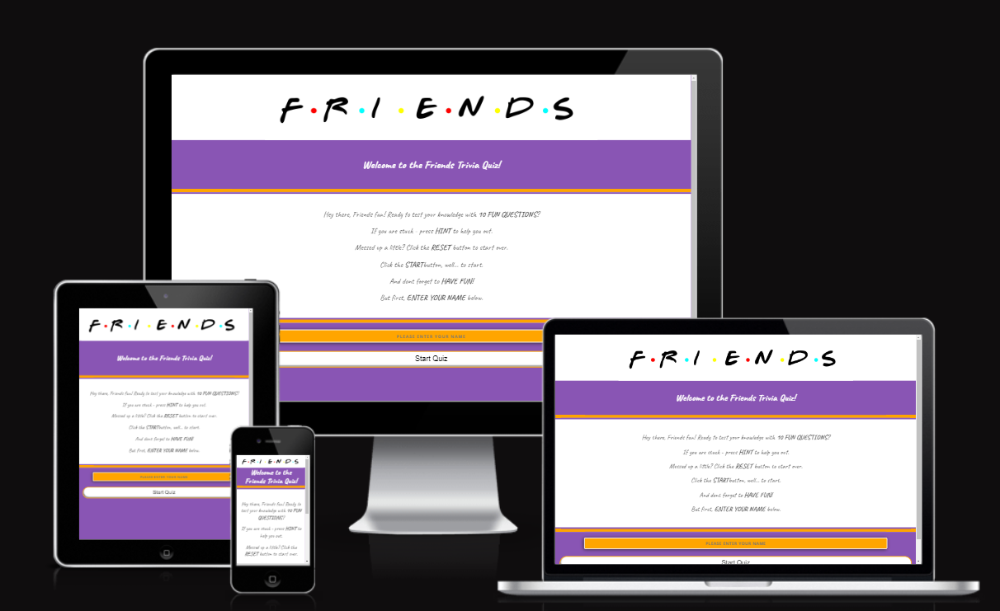

<h1 align="center">Friends Trivia Quiz</h1>

Link to deployed site: [Friends Trivia Quiz](https://monika-mak.github.io/Project_Portfolio_2-Friends_Trivia/)

This website  is designed to bring fun and excitement. Created for the true fans of the TV show "Friends" who want to test their knowledge about the series. It aims to provide an engaging and fun way to revisit memorable moments and details from the show.

## UX

### User Stories

**As a user I:**

* Want the quiz to be responsive to my devices.
* Want clear instructions on how to navigate through the quiz.
* Want to know how many questions are there.
* Want to know if I selected the correct answer.
* Want to get help if I am stuck on a question.
* Want to be able to reset the quiz if I made a mistake.
* Want to know what question number I am on during the quiz.
* Want to know my score during the quiz.
* Want to know what the correct answer is if I selected the wrong answer.
* Want to know my final score.

### First Time Visitor Goals

1. Understand the main purpose of the site and learn about the Friends trivia quiz.
2. Navigate the site easily to start the quiz or learn more about it.
3. Experience a flashback into the show's great moments.

### Returning Visitor Goals

1. Access new or updated quiz questions.
2. Switch off from everyday life and have fun.
3. Check for any new features or updates related to the quiz.

### Frequent User Goals

1. Stay updated with new trivia questions.
2. Regularly review and improve trivia knowledge.

## Design

### Colour Scheme

The website uses a palette of purple, orange, and white. Colors were carefully selected to bring the user back into the famous apartment with the iconic purple door with a golden frame.

- [Colors](readme_documents/colors.png)

### Typography

I chose the Google font Caveat to mimic the famous Friends font (Gabriel Weiss), balanced with classy Open Sans for good readability.

### Logo

The main concept of creating the logo was to bring the user back in time to their favorite TV show. The logo is made of letters F-R-I-E-N-D-S with multicolor dots in between each letter. Created by myself using the Gabriel Weiss font that was originally used for the show's logo and then converted into a picture for ease of use and consistency.
- [Logo](assets/images/logo_friends.jpg)

### Wireframes

- Welcome Page - [View](readme_documents/wire_frames/wire_frame_1.jpg)
- Quiz Game - [View](readme_documents/wire_frames/wire_frame_2.jpg)
- Results Page - [View](readme_documents/wire_frames/wire_frame_3.jpg)

 

# Friends Trivia Quiz Feature Overview

## Website Structure and Navigation
- **Logo and Branding:** The Friends Trivia Quiz logo is prominently displayed at the top of the page, reinforcing the theme on every page.

### Welcome Page

- **Welcome Message:** On arrival, the user is welcomed in a very friendly manner with a message. The text highlights the number of questions, describes the game, and gives helpful tips like the usage of hint and reset buttons. The user is directed to the bottom of the page to insert their name to start the game.Once the name is inserted, the user is advised to press the "start" button to begin.

    *Welcome Page Message*
    - [View](readme_documents/responsively-screenshots/visual_page_1.jpeg)

 - **Name Validation:** In the event of no name inserted, the user is reminded to fill in the name by a drop-down message. 

    *Name Validation* 
    - [Name Validation](/readme_documents/name_validation.png)

### Quiz Section

- **Visual Appeal:** The quiz logo appears at the top of the page, consistently maintaining the feel of the show. In the top left corner, under the logo, is a counter number where the current question number is displayed out of 10. In the top right corner, under the logo, there is a score counter with the number of correct answers. 
Below the scores, in the center, a random question is displayed with four possible answers to choose from. Underneath the answer options, on the left, there is a hint button styled nicely with a lightbulb icon. 
Beside the hint button, there is a reset button where the user can start over. 
Each button has a pointer configured to appear once the user scrolls over on larger screen sizes.

    *Quiz Game* - [View](readme_documents/responsively-screenshots/visual_page_2.jpeg)
- **Correct / incorrect answer (feedback):** 
when an incorrect answer is selected the option button turns red. The correct answer also turns green for the imediate feedback to the user.  
- Once an answer is selected the options are then disabled so correct score is recorded.

    *Correct / Incorrect Answer* - [View](readme_documents/responsively-screenshots/answers_correct_incorrect.png)

#### End Game Page and Results

- **Message:** The user is congratulated with a personalized message and their score, informed that they have reached the end of the game, and directed to choose either to play again or go back to the home page.
- *Results Page* - [View](readme_documents/responsively-screenshots/visual_page_3.jpeg)
#### Error Page

- **Error Message:** This page was designed for learning purposes; no try and catch error needed as there are no external applications used for the purpose of this quiz.
- *Error Page* - [View](readme_documents/error-page-screenshot.png)
### Functional Highlights ( All above tested and worked well)

- **User Input:** Where the user inserts their name, if no name is inserted, the pop up message appears from the top of the page. 
- **Start Button:** The user needs to act on whether or not they want to start the quiz, this function brings user to start of the quiz. 
- **Multiple Choice Section:** The user selects one of four available answers to the displayed question, color coded answers will display accordignally ( green for correct, red for oncorrect and the green will also display)
- **Hint Button:** Hint to the displayed question is shown( after clicking it , a message with the hint  will pop up)
- **Reset:** Where user can start from the first question, this function sucesfully clears score counter and quetion counter. 
- **Play Button:** Brings the user back to the start of the game.
- **Home Button:** Brings the user back to the home page, where user needs to put their name again. Perfect for multiple users. 

## Future Enhancements

- **Timer:** Implementation of a timer for increased difficulty.
- **Difficulty Level:** Adding questions with options for various levels of difficulties (easy, medium, hard).
- **Esthetics:** A nice looking pop-up message when the user hasn't inserted their name would be a nice touch.
- **Community Features:** Options for users to save their scores, share their results on social platforms and compete with others via a leaderboard.

## Resources and Tools Used

### Fonts and Icons

- [Google Fonts](https://fonts.google.com/) - Imported fonts used throughout the website.
- [Font Awesome](https://fontawesome.com/) - Provided the iconography on the website.
- [Dafont: Gabriel Weiss' Friends](https://www.dafont.com/gabriel-weiss-friends.font) - Used in creating a logo with the iconic "friends" font.

### Development Tools

- [Google Dev Tools](https://developer.chrome.com/docs/devtools/) - Used for troubleshooting, testing features, and solving issues related to responsiveness and styling.
- [GitHub](https://github.com/) - Used to save and store the project files.

### Image and Color Resources

- [Photopea](https://www.photopea.com/) - Used for logo creation.
- [Responsively](https://responsively.app/) - used to capture ewebsite responsivenes. 
- [Browserstack](https://www.browserstack.com/) - used to test browser responsivenes. 
- [Tiny PNG](https://tinypng.com/) - Compressed images to optimize website performance.
- [Favicon.io](https://favicon.io/) - Tool used to create the website's favicon.
- [Coolors](https://coolors.co/) - Assisted in creating a modern, matching color palette.
- [Canva](https://www.canva.com/) - Used for creating mockups and wireframes.

## Responsiveness

### Welcome Page
- Welcome page displayed on three different devices. 
    

Welcome Page Responsivenes

    *Welcome Page Mobile*

    

    *Welcome Page Tablet*

    
        
    *Welcome Page Desktop*

    

### Quiz Page
- Quiz page displayed on three different devices. 
    

Quiz Page Responsiveness

    *Quiz Page Mobile*

    

    *Quiz Page Tablet*

    
        
    *Quiz Page Desktop*

    

### End Page
- End page displayed on three different devices. 
    

End Page Responsiveness

    *End Page Mobile*

    

    *End Page Tablet*

    
        
    *End Page Desktop*

    

### Languages Used

- HTML
- CSS
- JavaScript

## Testing

### Code Validation

- The HTML validator returned no errors, [results](/readme_documents/W3C-JHint-validators/HTML_Validator.png "W3C HTML").
- The HTML Error page validator returned no errors,[results](/readme_documents/W3C-JHint-validators/HTML_Error_Page_Validator.png "W3C HTML Error Page").
- The CSS validator returned no errors, and one warning [results](/readme_documents/W3C-JHint-validators/CSS_DirectInput_Validator.png "W3C CSS").
- The CSS validator via URL returned no errors and no warnings [results](/readme_documents/W3C-JHint-validators/CSS_URL_Validation.png "W3C CSS URL").
- The JavaScript validator also returned no errors, [results](/readme_documents/W3C-JHint-validators/JS_Hint_Validator.png "JSHint").

### Lighthouse Testing

- The Lighthouse test for mobile passed 90% ; here are the [results](readme_documents/lighthouse-mobile.png).
- The Lighthouse test for mobile passed; readable rapport available here  [rapport](readme_documents/lighthouse_testing/lighthouse_mobile_.rapport.html).
- The Lighthouse test for desktop also passed; here are the [results](readme_documents/lighthouse-desktop.png).
- The Lighthouse test for desktop passed 96%; readable rapport available here  [rapport](readme_documents/lighthouse_testing/lighthouse_desktop_rapport.html).

### Browser Testing 

- The website has been tested on multiple browsers: Chrome- main, Firefox, Safari ,Edge and Opera with no errors or bugs. 

    

Browser Testing

    *Edge*

    

    *Firefox*

    

    *Safari*

    

    *Opera*

    

### Further Testing

Friends and family tested the site for usability issues and bugs.

### Known Bugs

No known bugs recorded.

## Deployment

### GitHub Pages

The project was deployed to GitHub Pages using the following steps:

1. Log in to GitHub and locate the [Friends_Trivia Repository](https://github.com/monika-mak/Project_Portfolio_2-Friends_Trivia).
2. At the top of the Repository (not top of page), locate the "Settings" button on the menu.
3. Scroll down the Settings page until you locate the "GitHub Pages" section.
4. Under "Source," click the dropdown called Source is set to 'Deploy from Branch' and select "main."
5. Make sure the folder is set to / (root).
6. Under Branch, click Save. The page will automatically refresh.
7. Scroll back down through the page to locate the now published site [Friends Trivia Quiz](https://monika-mak.github.io/Project_Portfolio_2-Friends_Trivia/) in the "GitHub Pages" section.

### Forking the GitHub Repository

By forking the GitHub Repository, we make a copy of the original repository on our GitHub account to view and/or make changes without affecting the original repository by using the following steps:

1. Log in to GitHub and locate the [Friends_Trivia Repository](https://github.com/monika-mak/Project_Portfolio_2-Friends_Trivia)
2. At the top of the Repository (not top of page) just above the "Settings" button on the menu, locate the "Fork" button.
3. You should now have a copy of the original repository in your GitHub account.

## Credits

### Idea

The game was inspired by my son who loves "Friends" and my own personal love for that show which made me laugh for so many years.

### Content

Content was inspired mainly by the tutorials below:
- Code Institute : Love Maths Project Walkthrough
- [How To Make Quiz App Using JavaScript](https://www.youtube.com/watch?v=PBcqGxrr9g8&t=1741s)
- [Build a Quiz App](https://www.youtube.com/watch?v=rFWbAj40JrQ&list=PLB6wlEeCDJ5Yyh6P2N6Q_9JijB6v4UejF)
- readme - some inspiration taken from KevinFlanagan7/Masters-quiz/main/README.md, thank you Kevin. 

### Learning and Support Resources

- [W3Schools](https://www.w3schools.com/) - For learning and practice.
- [YouTube](https://www.youtube.com/) - To source a deeper understanding of concepts.
- [Code Institute](https://codeinstitute.net/) - To structure and support learnings.
- [ChatGPT](https://openai.com/chatgpt) - generating questions, quick information support when needed.
- [Perplexity AI](https://www.perplexity.ai/) - For a focused source of information in one place.
- [Study Music, Concentration, Focus](https://www.youtube.com/results?search_query=study+music+concentration+focus) - To keep me calm during work.

### Personal comments and learnings 
-This was quite a journey and i am aware that bugs should be recorded in the readme, saying that I trust that section would take 3 days to complete and i hope commit history will be a great resource of it. Many of the issues I had found were simple semicolons or naming mistakes and some were as complicated as function being connected incorreclty. Once one bug was fixed another appeared which made the learning really deep.  

### Acknowledgements

A massive shout-out to:

- Amy Richardson again, thank you for your constant support as well as great advices and tips given throughout the process.
- Femi - my mentor who utilized our meetings very well, giving constructive feedback and excellent practice, your feedback is always very powerful and to the point.
- Huge thanks to the tutor support and community. It was a great help to feel like I am not here alone.
